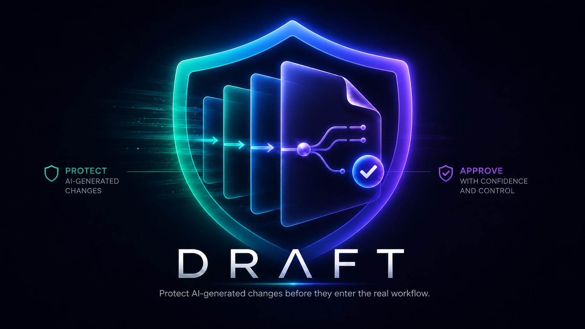
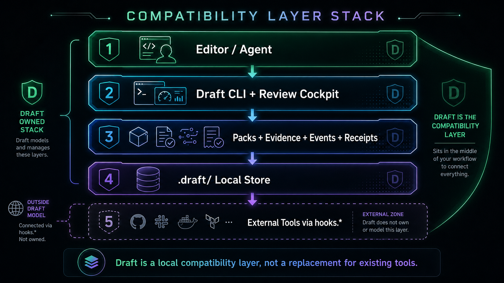
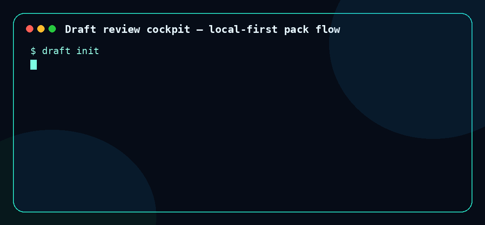
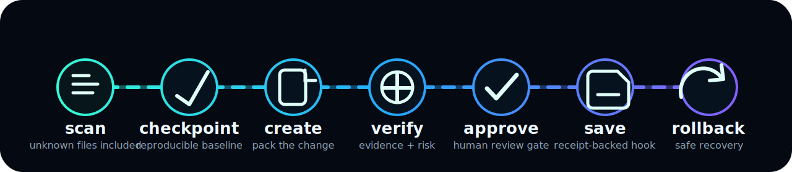

<!--
  Draft README

  Repo-ready assets expected under ./assets:
  - assets/draft-head-logo.png
  - assets/draft-flow.svg
  - assets/draft-cli-demo.gif
  - assets/draft-compatability-layer.png
  - assets/draft-noise-to-verified-packs.svg
-->

<p align="center">
  
</p>

<h1 align="center">Draft</h1>

<p align="center">
  <strong>Local-first review, verification, approval, receipts, and rollback for human + AI-generated software changes.</strong>
</p>

<p align="center">
  <a href="#quick-start">Quick Start</a>
  ·
  <a href="#why-draft">Why Draft</a>
  ·
  <a href="#how-draft-works">How It Works</a>
  ·
  <a href="#commands">Commands</a>
  ·
  <a href="/docs/README.md">Docs</a>
  ·
  <a href="CONTRIBUTING.md">Contributing</a>
</p>

<p align="center">
  
  
  
  
  
</p>

---

## What Is Draft?

**Draft** is a local-first compatibility layer for reviewing and controlling software changes before they become part of your real workflow.

It sits between your editor, AI agents, CLI tools, and external automation. Draft turns workspace changes into **ChangePacks** with evidence, verification results, review state, approval state, durable receipts, and safe rollback targets.

Draft is built for the new workflow where humans and AI agents both create code, but the project still needs a trusted review boundary.

```text
Editor / Agent
      ↓
Draft CLI + Review Cockpit
      ↓
ChangePacks + Evidence + Events + Receipts
      ↓
.draft/ local store
      ↓
Optional external tools via explicit hooks
```

Draft does **not** replace Git, editors, CI, agents, or deployment tools. It gives them a local, auditable compatibility layer.

<p align="center">
  
</p>

## Why Draft?

AI agents can generate useful changes quickly, but fast generation creates a new problem: workspace noise.

Draft helps you turn that noise into reviewed, accountable, rollback-safe ChangePacks.

| Problem                            | What Draft Adds                                                        |
| ---------------------------------- | ---------------------------------------------------------------------- |
| AI changes are hard to trust       | Changes are captured as named ChangePacks with evidence and provenance.      |
| Review happens too late            | Draft creates a local approval boundary before save/finalization.      |
| Workspace state gets messy         | Draft separates working noise from reviewed ChangePacks.                     |
| Hidden state can leak into changes | `.draft/` is hard-excluded everywhere.                                 |
| Rollback is unclear                | Rollback can target checkpoints, ChangePacks, or receipts.                   |
| External tools are too implicit    | Hooks are explicit, local, opaque, policy-checked, and receipt-backed. |
| Teams need auditability            | Events and receipts make every meaningful action explainable.          |

<p align="center">
  
</p>

## Core Principles

Draft is designed around a few strict rules:

* **Local-first:** project state lives in the workspace under `.draft/`.
* **Offline-capable:** core CLI flows do not require a network service.
* **Daemonless by default:** the CLI can run directly without a background daemon.
* **Tool-neutral:** Draft does not depend on a specific AI model, editor, code host, or agent runtime.
* **Append-only provenance:** meaningful actions are recorded as hash-chained events.
* **Review before save:** ChangePacks must pass the local review and approval boundary before finalization.
* **Safe rollback:** checkpoints, ChangePacks, and receipts can be used as rollback targets.
* **Hard `.draft/` exclusion:** Draft never includes its private state in ChangePacks, snapshots, saves, rollback plans, or hook candidate checks.

## Quick Start

Build the workspace:

```bash
cargo build --workspace
```

Run the CLI during development:

```bash
cargo run -p draft-cli -- init
```

Or, once installed as `draft`:

```bash
draft init
```

Set your local identity:

```bash
draft config set identity.username "Ada"
draft config set identity.email "ada@example.com"
```

Create a checkpoint, make changes, package them, review them, approve them, and save them:

```bash
draft checkpoint "before change"

# Edit the workspace with your editor, script, or AI agent.

draft status
draft create "update app"

draft list
draft pack

draft verify -p <pck-id-or-name>
draft risk -p <pck-id-or-name>
draft review -p <pck-id-or-name>
draft approve -p <pck-id-or-name> --reason "reviewed"
draft save -p <pck-id-or-name>

draft receipt list
```

<p align="center">
  
</p>

## The ChangePack Flow

Draft’s main object is a **ChangePack**.

A ChangePack is a local, reviewable unit of change. It contains the change set, evidence, verification results, review decisions, approval state, and event references needed to understand what happened.

Typical flow:

```text
draft init
draft checkpoint "before agent run"
agent/editor changes files
draft status
draft create "feature name"
draft verify -p <ChangePack>
draft review -p <ChangePack>
draft approve -p <ChangePack>
draft save -p <ChangePack>
draft rollback <target>   # when needed
```

<p align="center">
  
</p>

## IDs And Targets

Draft uses stable ID prefixes:

```text
chk_<id>  checkpoint
pck_<id>  ChangePack
rcp_<id>  receipt
```

Rollback accepts any of these:

```bash
draft rollback chk_<id>
draft rollback pck_<id>
draft rollback rcp_<id>
```

Most ChangePack commands accept either a ChangePack ID or a unique ChangePack name:

```bash
draft verify -p pck_abc123
draft verify -p "update app"
```

## Commands

The v0.3.1 command surface is intentionally local and workspace-oriented.

```text
init       config     hook       ignore     status
event      checkpoint create    pack       list
candidate  task       verify    risk       review
approve    reject     compare   compose    disperse
save       receipt    storage   rollback
```

### ChangePack Commands

Create a new ChangePack:

```bash
draft create <name> [-p <base-pck-id-or-name>]
```

ChangePack names must be unique.

Show the current selected ChangePack:

```bash
draft pack
```

Select a ChangePack by ID or name:

```bash
draft pack -s <pck-id-or-name>
```

Delete a ChangePack by ID or name:

```bash
draft pack -d <pck-id-or-name>
```

Deleting a ChangePack does not delete event history, logs, receipts, or provenance records.

List generated ChangePacks:

```bash
draft list
```

### Event Commands

Human-readable timeline:

```bash
draft event
```

Raw event records:

```bash
draft event --raw
```

Verify the event hash chain:

```bash
draft event --verify-chain
```

Draft stores provenance as append-only hash-chained event records. The normal `draft event` timeline is a readable view derived from that raw stream; there is no separate durable human log file outside the event model.

### Candidate And Task Commands

Candidates are named execution profiles. They do not represent roles in v0.3.1.

Run a task with an explicit instruction boundary:

```bash
draft task spawn "<task-name>" -- <instruction>
```

Route a task through a candidate:

```bash
draft task spawn "<task-name>" -c <candidate-name> -- <instruction>
```

Candidates can be auto-registered through `draft task spawn`; users do not need to run a separate candidate registration command first.

## Optional Save Hook

`hooks.save` lets Draft call an explicit local command after approval.

Example:

```bash
draft config set hooks.save "printf %s \"{{message}}\" > .last-draft-save"
```

When `draft save` runs, Draft:

1. renders supported hook variables such as `{{message}}`;
2. checks local policy;
3. verifies that `.draft/` is not part of the save candidate;
4. executes the command from the workspace root;
5. captures stdout, stderr, exit code, and command hash;
6. writes a durable receipt.

Draft does not parse, detect, or model what the hook command does. Hooks are opaque by design.

## Storage And Safety

Draft stores local project state under `.draft/`:

```text
.draft/
├─ config and policy
├─ content-addressed objects
├─ snapshots and checkpoints
├─ tasks and runs
├─ ChangePacks and evidence
├─ reviews and approvals
├─ receipts
├─ rebuildable indexes
└─ append-only hash-chained events
```

`.draft/` is always hard-excluded from:

```text
status
snapshots
ChangePacks
save candidates
rollback plans
hook candidate checks
```

If a save candidate contains `.draft/`, Draft aborts the save, emits a failed `save.completed` event, records a failed receipt, and does not run `hooks.save`.

## What Draft Is Not

Draft is not:

* a Git replacement;
* a hosted code review system;
* a hosted merge workflow;
* a CI/CD platform;
* an AI model service;
* an agent framework;
* a deployment tool.

Draft is the local review layer that can sit in front of those tools.

## Documentation

Start with [docs/README.md](docs/README.md).

| Topic              | Link                                                     |
| ------------------ | -------------------------------------------------------- |
| Installation       | [docs/installation.md](docs/installation.md)             |
| Getting Started    | [docs/getting-started.md](docs/getting-started.md)       |
| Concepts           | [docs/concepts.md](docs/concepts.md)                     |
| Architecture       | [docs/architecture.md](docs/architecture.md)             |
| Command Reference  | [docs/command-reference.md](docs/command-reference.md)   |
| Configuration      | [docs/configuration.md](docs/configuration.md)           |
| Storage Layout     | [docs/storage-layout.md](docs/storage-layout.md)         |
| Event Model        | [docs/event-model.md](docs/event-model.md)               |
| ChangePacks        | [docs/changepack.md](docs/changepack.md)                 |
| Checkpoints        | [docs/checkpoints.md](docs/checkpoints.md)               |
| Verification       | [docs/verification.md](docs/verification.md)             |
| Review & Approval  | [docs/review-and-approval.md](docs/review-and-approval.md) |
| Policy             | [docs/policy.md](docs/policy.md)                         |
| Receipts           | [docs/receipts.md](docs/receipts.md)                     |
| Rollback           | [docs/rollback.md](docs/rollback.md)                     |
| Candidates & Tasks | [docs/candidates-and-tasks.md](docs/candidates-and-tasks.md) |
| Safety Model       | [docs/safety-model.md](docs/safety-model.md)             |
| Services           | [docs/services.md](docs/services.md)                     |
| Security           | [docs/security.md](docs/security.md)                     |
| Release Compliance | [docs/release-compliance.md](docs/release-compliance.md) |
| FAQ                | [docs/faq.md](docs/faq.md)                               |

## Development

Run the standard checks:

```bash
cargo fmt --all -- --check
cargo clippy --workspace --all-targets -- -D warnings
cargo test --workspace
```

Useful local loop:

```bash
cargo run -p draft-cli -- init
cargo run -p draft-cli -- status
cargo run -p draft-cli -- create "test changepack"
cargo run -p draft-cli -- list
```

See [CONTRIBUTING.md](CONTRIBUTING.md) for contribution guidelines, development workflow, and release expectations.

## Project Status

Draft is pre-1.0 software. The current focus is v0.3.1 production readiness:

* CLI ergonomics;
* ChangePack naming and selection;
* review cockpit flows;
* event log UX;
* rollback target semantics;
* documentation alignment;
* safety and release compliance.

Public APIs and storage details may still evolve before 1.0.

## License

Licensed under the terms in [LICENSE](LICENSE).
