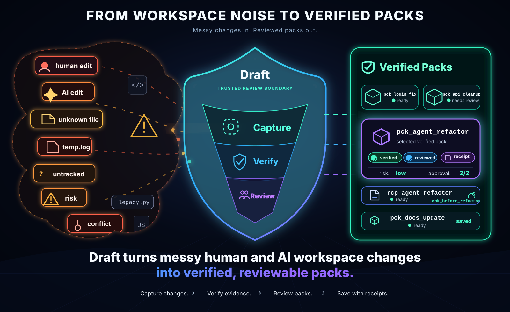

<!--
  Draft README

  Repo-ready assets expected under ./assets:
  - assets/draft-head-logo.png
  - assets/draft-flow.svg
  - assets/draft-cli-demo.gif
  - assets/draft-compatability-layer.png
  - assets/draft-noise-to-verified-packs.svg
-->

<p align="center">
  
</p>

<h1 align="center">Draft</h1>

<p align="center">
  <strong>Local-first review, verification, approval, receipts, and rollback for human + AI-generated software changes.</strong>
</p>

<p align="center">
  <a href="#quick-start">Quick Start</a>
  ·
  <a href="#why-draft">Why Draft</a>
  ·
  <a href="#how-draft-works">How It Works</a>
  ·
  <a href="#commands">Commands</a>
  ·
  <a href="/docs/README.md">Docs</a>
  ·
  <a href="CONTRIBUTING.md">Contributing</a>
</p>

<p align="center">
  
  
  
  
  
</p>

---

## What Is Draft?

**Draft** is a local-first compatibility layer for reviewing and controlling software changes before they become part of your real workflow.

It sits between your editor, AI agents, CLI tools, and external automation. Draft turns workspace changes into **Packs** with evidence, verification results, review state, approval state, durable receipts, and safe rollback targets.

Draft is built for the new workflow where humans and AI agents both create code, but the project still needs a trusted review boundary.

```text
Editor / Agent
      ↓
Draft CLI + Console
      ↓
Packs + Evidence + Events + Receipts
      ↓
.draft/ local store
      ↓
Optional external tools via explicit hooks
```

Draft does **not** replace Git, editors, CI, agents, or deployment tools. It gives them a local, auditable compatibility layer.

<p align="center">
  
</p>

## Why Draft?

AI agents can generate useful changes quickly, but fast generation creates a new problem: workspace noise.

Draft helps you turn that noise into reviewed, accountable, rollback-safe Packs.

| Problem                            | What Draft Adds                                                        |
| ---------------------------------- | ---------------------------------------------------------------------- |
| AI changes are hard to trust       | Changes are captured as named Packs with evidence and provenance.      |
| Review happens too late            | Draft creates a local approval boundary before submit/finalization.    |
| Workspace state gets messy         | Draft separates working noise from reviewed Packs.                     |
| Hidden state can leak into changes | `.draft/` is hard-excluded everywhere.                                 |
| Rollback is unclear                | Rollback can target checkpoints, Packs, or receipts.                   |
| External tools are too implicit    | Hooks are explicit, local, opaque, policy-checked, and receipt-backed. |
| Teams need auditability            | Events and receipts make every meaningful action explainable.          |

<p align="center">
  
</p>

## Core Principles

Draft is designed around a few strict rules:

- **Local-first:** project state lives in the workspace under `.draft/`.
- **Offline-capable:** core CLI flows do not require a network service.
- **Daemonless by default:** the CLI can run directly without a background daemon.
- **Tool-neutral:** Draft does not depend on a specific AI model, editor, code host, or agent runtime.
- **Append-only provenance:** meaningful actions are recorded as hash-chained events.
- **Review before submit:** Packs must pass the local review and approval boundary before finalization.
- **Safe rollback:** checkpoints, Packs, and receipts can be used as rollback targets.
- **Hard `.draft/` exclusion:** Draft never includes its private state in Packs, snapshots, submits, rollback plans, or hook candidate checks.

## Quick Start

Install the latest Draft release on Linux, macOS, or WSL:

```bash
curl -fsSL https://raw.githubusercontent.com/Shiva936/draft/master/install.sh | sh
```

Install the latest Draft release on native Windows PowerShell:

```powershell
irm https://raw.githubusercontent.com/Shiva936/draft/master/install.ps1 | iex
```

Then initialize Draft in a workspace:

```bash
draft init
```

Optionally set non-security display/contact metadata. Use `--global` for a machine-wide default; a project value overrides it:

```bash
draft config set user.name "Ada" --global
draft config set user.email "ada@example.com" --global
```

These fields never change Draft's stable actor ID, signing keys, trust, authorization, attribution, receipts, event hashes, or workspace/Pack digests. If no name is configured, Draft resolves the non-persisted fallback `unknown`.

Create a checkpoint, make changes, package them, review them, approve them, and submit them:

```bash
draft checkpoint "before change"

# Edit the workspace with your editor, script, or AI agent.

draft status
draft create "update app"

draft list
draft pack

draft verify -p <pck-id-or-name>
draft risk -p <pck-id-or-name>
draft review -p <pck-id-or-name>
draft approve -p <pck-id-or-name> --reason "reviewed"
draft submit -p <pck-id-or-name>

draft receipt list
```

Developers can also build from source:

```bash
cargo build --workspace
cargo run -p draft-cli -- init
```

<p align="center">
  
</p>

## The Pack Flow

Draft’s main object is a **Pack**.

A Pack is a local, reviewable unit of change. It contains the change set, evidence, verification results, review decisions, approval state, and event references needed to understand what happened.

Typical flow:

```text
draft init
draft checkpoint "before agent run"
agent/editor changes files
draft status
draft create "feature name"
draft verify -p <Pack>
draft review -p <Pack>
draft approve -p <Pack>
draft submit -p <Pack>
draft rollback <target>   # when needed
```

<p align="center">
  
</p>

## IDs And Targets

Draft uses stable ID prefixes:

```text
chk_<id>  checkpoint
pck_<id>  Pack
rcp_<id>  receipt
```

Rollback accepts any of these:

```bash
draft rollback chk_<id>
draft rollback pck_<id>
draft rollback rcp_<id>
```

Most Pack commands accept either a Pack ID or a unique Pack name:

```bash
draft verify -p pck_abc123
draft verify -p "update app"
```

## Commands

The command surface is intentionally local and workspace-oriented.

```text
init       service    project    doctor     console
extension  config     hook       ignore     status
event      task       inbox      waive      checkpoint
create     pack       list       candidate  verify
risk       review     approve    reject     compare
compose    disperse   submit     rollback   receipt
close      gc         storage
```

### Pack Commands

Create a new Pack:

```bash
draft create <name> [-p <base-pck-id-or-name>]
```

Pack names must be unique.

Show the current selected Pack:

```bash
draft pack
```

Select a Pack by ID or name:

```bash
draft pack -s <pck-id-or-name>
```

Delete a Pack by ID or name:

```bash
draft pack -d <pck-id-or-name>
```

Deleting a Pack preserves event history and receipts. Draft removes the pack directory, removes task/run records owned only by that pack, and garbage-collects unreachable objects.

List generated Packs:

```bash
draft list
```

### Event Commands

Human-readable timeline:

```bash
draft event
```

Raw event records:

```bash
draft event --raw
```

Verify event, receipt, and transparency integrity:

```bash
draft doctor
draft receipt verify --all
```

Draft stores provenance as append-only hash-chained event records linked to signed receipts and the local transparency chain. The normal `draft event` timeline is a readable view derived from that raw stream; there is no separate durable human log file outside the event model.

### Candidate And Task Commands

Candidates are named execution profiles. They do not represent roles.

Run a task with an explicit instruction boundary:

```bash
draft task spawn "<task-name>" -- <instruction>
```

Route a task through a candidate:

```bash
draft task spawn "<task-name>" -c <candidate-name> -- <instruction>
```

Candidates can be auto-registered through `draft task spawn`; users do not need to run a separate candidate registration command first.

## Optional Submit Hook

`hooks.submit` lets Draft call an explicit local command after approval.

Example:

```bash
draft config set hooks.submit "printf %s \"{{message}}\" > .last-draft-submit"
```

When `draft submit` runs, Draft:

1. renders supported hook variables such as `{{message}}`;
2. checks local policy;
3. verifies canonical approval, workspace hash, receipt signatures, event chain, and transparency linkage;
4. verifies that `.draft/` is not part of the submit candidate;
5. executes the command from the workspace root;
6. captures stdout, stderr, exit code, and command hash;
7. writes a durable receipt.

Draft does not parse, detect, or model what the hook command does. Hooks are opaque by design.

## Storage And Safety

Draft stores local project state under `.draft/`:

```text
.draft/
├─ config and policy
├─ content-addressed objects
├─ snapshots and checkpoints
├─ tasks and runs
├─ Packs and evidence
├─ reviews and approvals
├─ receipts
├─ rebuildable indexes
└─ append-only hash-chained events
```

`.draft/` is always hard-excluded from:

```text
status
snapshots
Packs
submit candidates
rollback plans
hook candidate checks
```

If a submit candidate contains `.draft/`, Draft aborts the submit, emits a failed `submit.completed` event, records a failed receipt, and does not run `hooks.submit`.

Persisted and wire boundaries are self-describing. Each registered contract owns its own `schema_version`; every contract shipped currently supports only version `1`, but one contract can evolve without changing unrelated contracts. `draft_version` records product provenance and does not decide workspace compatibility. `/api/v1/...` remains the stable Console HTTP compatibility boundary.

## What Draft Is Not

Draft is not:

- a Git replacement;
- a hosted code review system;
- a hosted merge workflow;
- a CI/CD platform;
- an AI model service;
- an agent framework;
- a deployment tool.

Draft is the local review layer that can sit in front of those tools.

## Documentation

Start with [docs/README.md](docs/README.md).

| Topic                         | Link                                                                         |
| ----------------------------- | ---------------------------------------------------------------------------- |
| Installation                  | [docs/guides/installation.md](docs/guides/installation.md)                   |
| Getting Started & FAQ         | [docs/guides/getting-started.md](docs/guides/getting-started.md)             |
| Workflows                     | [docs/guides/workflows.md](docs/guides/workflows.md)                         |
| Command Reference             | [docs/reference/commands.md](docs/reference/commands.md)                     |
| Concepts                      | [docs/reference/concepts.md](docs/reference/concepts.md)                     |
| Configuration                 | [docs/reference/configuration.md](docs/reference/configuration.md)           |
| Review, Verification & Policy | [docs/reference/review-and-policy.md](docs/reference/review-and-policy.md)   |
| Architecture & Services       | [docs/internals/architecture.md](docs/internals/architecture.md)             |
| Storage & Events              | [docs/internals/storage-and-events.md](docs/internals/storage-and-events.md) |
| Security                      | [docs/internals/security.md](docs/internals/security.md)                     |
| Protocol Contracts            | [docs/internals/protocol.md](docs/internals/protocol.md)                     |

## Development

Run the standard checks:

```bash
cargo fmt --all -- --check
cargo clippy --workspace --all-targets -- -D warnings
cargo test --workspace
```

Useful local loop:

```bash
cargo run -p draft-cli -- init
cargo run -p draft-cli -- status
cargo run -p draft-cli -- create "test pack"
cargo run -p draft-cli -- list
```

See [CONTRIBUTING.md](CONTRIBUTING.md) for contribution guidelines, development workflow, and release expectations.

## Project Status

Draft is pre-1.0 software. The current focus is production readiness:

- CLI ergonomics;
- verified, signed, portable packs;
- Draft Console flows;
- event, receipt, and transparency integrity;
- import/export and rollback safety;
- documentation alignment;
- security, performance, and release compliance.

Public APIs and storage details may still evolve before 1.0.

## License

Licensed under the terms in [LICENSE](LICENSE).
