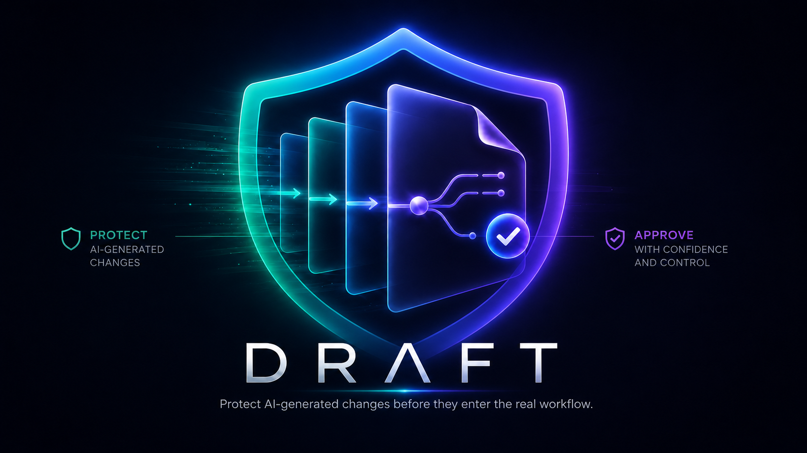
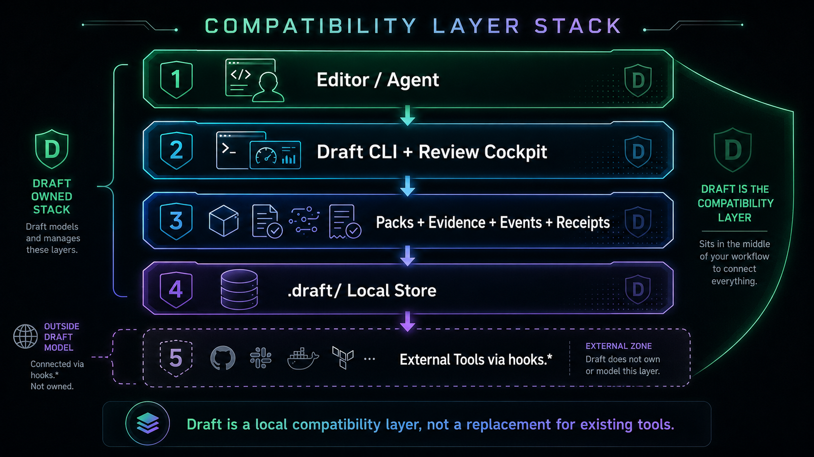
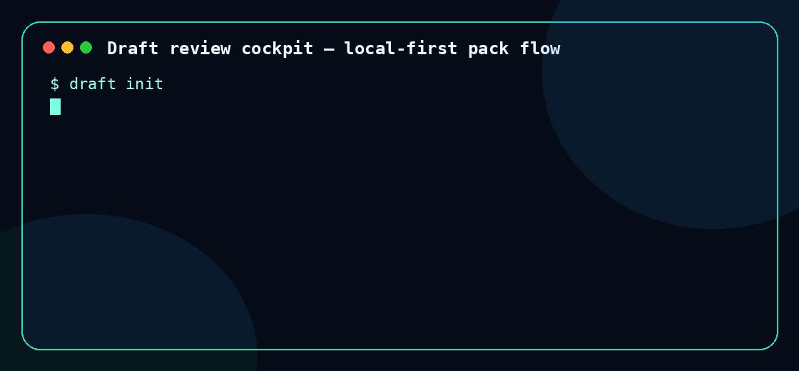
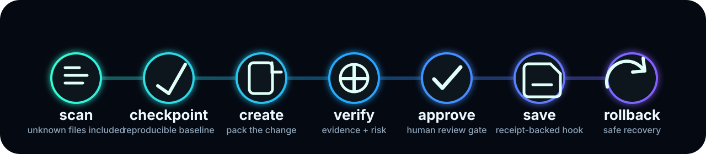

<!--
  Draft README

  Repo-ready assets expected under ./assets:
  - assets/draft-head-logo.png
  - assets/draft-flow.svg
  - assets/draft-cli-demo.gif
  - assets/draft-compatability-layer.png
  - assets/draft-noise-to-verified-Changes.svg
-->

<p align="center">
  
</p>

<h1 align="center">Draft</h1>

<p align="center">
  <strong>Human control over agent-scale changes.</strong><br/>
  <em>Local-first evidence, gates, decisions, receipts and recovery for what people and agents change.</em>
</p>

<p align="center">
  <a href="#quick-start">Quick Start</a>
  ·
  <a href="#why-draft">Why Draft</a>
  ·
  <a href="#how-draft-works">How It Works</a>
  ·
  <a href="#commands">Commands</a>
  ·
  <a href="/docs/README.md">Docs</a>
  ·
  <a href="CONTRIBUTING.md">Contributing</a>
</p>

<p align="center">
  
  
  
  
  
</p>

---

## What Is Draft?

**Draft** gives humans control over agent-scale changes.

It is a local-first change-control layer: it observes a project's state, captures what changed into reviewable **Changes** with evidence, verification results, review state, approval state, durable receipts and safe rollback targets, and holds all of it behind a human approval boundary.

Draft is built for the workflow where humans and agents both produce work faster than anyone can review it line by line.

```text
Person / Agent
      ↓
Draft CLI + Console
      ↓
Changes + Evidence + Events + Receipts
      ↓
.draft/ local store
      ↓
Optional external tools via explicit hooks
```

### Draft is domain-neutral

Draft manages **resources**, **changes**, **evidence** and **approvals**. It does not know what your resources _are_.

Nothing in Draft knows about files-as-text, programming languages, test suites, compilers or version-control systems. Software is the first ecosystem it supports, not the thing it is built out of — every piece of that knowledge lives in an extension you install and authorize.

That means Draft works on a codebase, and equally on a document set, a configuration estate, a catalog, or anything else with resources that change and people who need to approve those changes.

What Draft owns is mechanism, authority and evidence: what state was observed, what provably changed, who approved it, what can be restored. What an extension owns is meaning: what a resource is, how to compare it, how to check it, what makes it risky.

With nothing installed, Draft still runs the whole controlled lifecycle. It just says plainly what it cannot interpret rather than guessing.

Draft does **not** replace Git, editors, CI, agents, or deployment tools. It gives them a local, auditable control layer.

<p align="center">
  
</p>

## Why Draft?

AI agents can generate useful changes quickly, but fast generation creates a new problem: workspace noise.

Draft helps you turn that noise into reviewed, accountable, rollback-safe Changes.

| Problem | What Draft Adds |
| --- | --- |
| AI changes are hard to trust | Changes are captured as named Changes with evidence and provenance. |
| Review happens too late | Nothing is accepted until a person decides, over one exact revision. |
| Workspace state gets messy | Draft separates working noise from reviewed Changes. |
| Hidden state can leak into changes | `.draft/` is hard-excluded everywhere. |
| Rollback is unclear | Recovery targets a checkpoint, a Change, or the Activity event that recorded one. |
| External tools are too implicit | Hooks are explicit, local, opaque, policy-checked, and receipt-backed. |
| Teams need auditability | Events and receipts make every meaningful action explainable. |

<p align="center">
  
</p>

## Core Principles

Draft is designed around a few strict rules:

- **Local-first:** project state lives in the workspace under `.draft/`.
- **Offline-capable:** core CLI flows do not require a network service.
- **Daemonless by default:** the CLI can run directly without a background daemon.
- **Tool-neutral:** Draft does not depend on a specific AI model, editor, code host, or agent runtime.
- **Domain-neutral:** Draft's model is resources and changes. Every domain-specific meaning — what a resource is, how it compares, how it is checked — arrives through an installed, authorized extension.
- **Honest about what it does not know:** a missing capability is reported as a missing capability. It never reads as a pass, a low risk, or an absence.
- **Append-only provenance:** meaningful actions are recorded as hash-chained events.
- **Nothing is accepted without a decision:** a Promotion is the only operation that advances what the project accepts, and it happens only on an approving Decision citing a satisfied Gate over the exact revision.
- **Safe recovery:** checkpoints, Changes, and the Activity events that recorded them are recovery targets, and a plan names what would be removed before anything runs.
- **Hard `.draft/` exclusion:** Draft never includes its private state in Changes, snapshots, change candidates, recovery plans, or hook candidate checks.

## Quick Start

Install the latest Draft release on Linux, macOS, or WSL:

```bash
curl -fsSL https://raw.githubusercontent.com/Shiva936/draft/master/install.sh | sh
```

Install the latest Draft release on native Windows PowerShell:

```powershell
irm https://raw.githubusercontent.com/Shiva936/draft/master/install.ps1 | iex
```

Then initialize Draft in a workspace:

```bash
draft init
```

Optionally set non-security display/contact metadata. Use `--global` for a machine-wide default; a project value overrides it:

```bash
draft config set user.name "Ada" --global
draft config set user.email "ada@example.com" --global
```

These fields never change Draft's stable actor ID, signing keys, trust, authorization, attribution, receipts, event hashes, or workspace/Change digests. If no name is configured, Draft resolves the non-persisted fallback `unknown`.

Checkpoint, change the project, seal what changed, gather evidence, decide, and promote:

```bash
draft change checkpoint "before change"

# Change the project however you like — by hand, by script, or by agent.

draft status
draft change new "update app" --scope src/app.rs
draft change revision seal <chg-id>

draft change evidence run <rev-id>
draft change assess <rev-id> --risk low
draft change gates evaluate <rev-id>
draft change decide <rev-id> --approve

draft promote <chg-id> <rev-id>
draft baseline show
draft baseline receipts
```

Developers can also build from source:

```bash
cargo build --workspace
cargo run -p draft-cli -- init
```

<p align="center">
  
</p>

## The Change Flow

Draft’s main object is a **Change**.

A Change is a local, reviewable unit of change. It contains the change set, evidence, verification results, review decisions, approval state, and event references needed to understand what happened.

Typical flow:

```text
draft init
draft change checkpoint "before agent run"
a person or agent changes the project
draft status
draft change new "feature name" --scope …
draft change revision seal <chg-id>
draft change evidence run <rev-id>
draft change gates evaluate <rev-id>
draft change decide <rev-id> --approve
draft promote <chg-id> <rev-id>
draft recover run <target>   # when needed
```

<p align="center">
  
</p>

## IDs And Targets

Draft uses stable ID prefixes:

```text
prj_<id>  project        chg_<id>  Change         rev_<id>  ChangeRevision
chk_<id>  checkpoint     evd_<id>  Evidence       asm_<id>  Assessment
dec_<id>  Decision       bas_<id>  Baseline       pro_<id>  Promotion
pub_<id>  Publication    pat_<id>  attempt        rcp_<id>  receipt
evt_<id>  Activity event res_<id>  Resource       obs_<id>  Observation
```

Recovery accepts any of these:

```bash
draft recover run chk_<id>       # a checkpoint
draft recover run chg_<id>       # a Change whose staging still holds a snapshot
draft recover run evt_<id>       # the Activity event that recorded a checkpoint
```

## Commands

The command surface is intentionally local and workspace-oriented.

```text
init       status     inbox      doctor     maintenance
config     daemon     project    task       change
resource   activity   recover    promote    baseline
authority  receipt    extension  console
```

Draft Console requires an explicit frontend mode:

```bash
draft console web [--project <workspace-id-or-path>] [--no-preselect]
draft console tui [--project <workspace-id-or-path>] [--no-preselect]
```

### Change Commands

Open a Change — what it is for, and exactly what it may touch:

```bash
draft change new <intent> --scope <res-id> [<res-id> ...]
```

The declared scope is resolved against the accepted Baseline, which may narrow it but never widen it. Re-running with the same intent converges on the Change it already opened.

Seal the project's current state as a revision:

```bash
draft change revision seal <chg-id>
```

The state is observed, not asserted. Sealing the same state twice is the same revision, so a re-run is not a second thing to review. Sealing also records the revision's representation — the derived explanation of what it did, bound to that exact revision and derived from the same observations.

Stop work on a Change by ID or name:

```bash
draft change abandon <chg-id-or-name>
draft change reopen <chg-id-or-name>
```

There is deliberately no delete. Abandoning says nothing about the past: every definition, revision, decision, receipt and event stays, and the Change is still listed. It says only that no further work will be done — and `reopen` takes that back.

List generated Changes:

```bash
draft change list
```

Ask how Changes stand to each other:

```bash
draft change conflicts <chg-id>
draft change compose <chg-id> <chg-id> [...]
draft change disperse <chg-id> <chg-id> [...]
```

Composition holds only when every pair is independent and every member was sealed from the same Baseline. Where a pair cannot be shown separable the answer is `conflicting` or `indeterminate`, never an optimistic `independent` — composing on a guess has a merge-shaped blast radius.

Ask what a revision reaches and what has actually been proved about it:

```bash
draft change impact <rev-id>
draft change coverage <rev-id>
```

Neither infers anything. An element exists because an authorized extractor said so; a Resource is covered because evidence read an observation of that exact Resource. Same directory, imported by, adjacent in the graph and named similarly are each rejected — every one of them would produce a confident "covered" for something nothing has ever verified.

### Activity Commands

Human-readable timeline:

```bash
draft activity list
```

Raw event records:

```bash
draft activity list --raw
```

Verify Activity, receipt, and transparency integrity:

```bash
draft doctor
draft doctor receipts --all
```

Draft stores provenance as an append-only, framed, hash-chained Activity Ledger, with signed receipts entered in the local transparency chain. `events/events.log` is the sole authoritative file; the `draft activity list` timeline is a readable view derived from it, and there is no separate durable human log.

### Candidate And Task Commands

Candidates are named execution profiles. They do not represent roles.

Run a task with an explicit instruction boundary:

```bash
draft task spawn "<task-name>" -- <instruction>
```

Route a task through a candidate:

```bash
draft task spawn "<task-name>" -c <candidate-name> -- <instruction>
```

Candidates can be auto-registered through `draft task spawn`; users do not need to run a separate candidate registration command first.

## Optional Hooks

A configured `hooks.*` entry lets Draft call an explicit local command.

```bash
draft config hook set verify "cargo test"
```

When the hook runs, Draft renders supported variables such as `{{message}}`, executes the command directly from the project root with a cleared environment and an enforced time limit, and captures stdout, stderr, exit code and the command hash as an `OperationExecuted` Activity event.

**A hook is never a promotion.** Nothing a hook does changes what the project accepts — that is Promotion's sole authority. Draft does not parse, detect, or model what a hook command does; hooks are opaque by design.

## Storage And Safety

Draft stores local project state under `.draft/`:

```text
.draft/
├─ config and policy
├─ content-addressed objects
├─ snapshots and checkpoints
├─ tasks and runs
├─ Changes, revisions and evidence
├─ gates, decisions and waivers
├─ baselines and promotions
├─ publications
├─ receipts and the transparency chain
├─ rebuildable indexes
└─ the append-only Activity Ledger
```

`.draft/` is always hard-excluded from:

```text
status
snapshots
Changes
change candidates
recovery plans
hook candidate checks
```

If a change candidate contains `.draft/`, Draft refuses the operation and records the refusal. It never partially applies work that reached into its own metadata.

Persisted and wire boundaries are self-describing. Each registered contract owns its own `schema_version`; every contract shipped currently supports only version `1`, but one contract can evolve without changing unrelated contracts. `draft_version` records product provenance and does not decide workspace compatibility. `/api/v1/...` remains the stable Console HTTP compatibility boundary.

## What Publication Actually Guarantees

Publication delivers a promoted Baseline to something outside Draft. What Draft can promise about an external system is bounded by what that system tells it, and Draft says so rather than rounding up:

- **A Baseline is accepted locally before anything is published.** Publication reads what Promotion accepted; it never creates or advances authority.
- **At most one primary outcome per attempt, and exactly one eventually for every attempt that durably reached dispatch.** A staged attempt that never dispatched needs none, ever.
- **`Indeterminate` is a real answer, not a retry prompt.** When Draft cannot learn whether an external effect happened, it records that it cannot know. Resolving it takes an explicit `resolve`, and trying again takes an explicit one-shot retry authorization — never a plain retry button, because a retry over an unknown outcome is how a duplicate external effect gets made.
- **A result that arrives late is reconciliation input, never a second outcome.** The authoritative outcome is not re-opened by news.
- **Local non-blocking is not permission to duplicate an external mutation.**

Draft's authority is local. External providers are optional and subordinate to it: a provider is how an accepted Baseline reaches the outside world, never a source of what this project accepts.

## What A Baseline Identifies

A `BaselineId` is the exact accepted historical node: material state, the provenance that establishes it, the coverage claims that justify absence, and lineage. Three roots answer three different questions and are never collapsed — `ProjectStateRoot` (what material state is accepted), `StateEvidenceRoot` (what exact provenance establishes it), `CoverageEvidenceRoot` (what justifies absence and domain completeness).

Re-observing the same material state through a different Observation can change `StateEvidenceRoot` and therefore `BaselineId` **without** changing `ProjectStateRoot`. That is deliberate: the project accepts the same state on different evidence, and a reader has to be able to see which.

Draft never says "timestamps are excluded from `BaselineId`." The rule is reachability from the manifest, not the datatype: observation and provenance timing never changes material-state identity, but provenance timestamps live inside canonical provenance objects whose digests feed the evidence and coverage roots, so changing one may legitimately change the `BaselineId`. What is genuinely outside it is the metadata the manifest cannot reach — acceptance time, actor and display metadata, Activity and telemetry timing, publication runtime timing, and non-manifest identifiers.

## What Draft Is Not

Draft is not:

- a Git replacement;
- a hosted code review system;
- a hosted merge workflow;
- a CI/CD platform;
- an AI model service;
- an agent framework;
- a deployment tool.

Draft is the local review layer that can sit in front of those tools.

## Documentation

Start with [docs/README.md](docs/README.md).

| Topic                         | Link                                                                         |
| ----------------------------- | ---------------------------------------------------------------------------- |
| Installation                  | [docs/guides/installation.md](docs/guides/installation.md)                   |
| Getting Started & FAQ         | [docs/guides/getting-started.md](docs/guides/getting-started.md)             |
| Workflows                     | [docs/guides/workflows.md](docs/guides/workflows.md)                         |
| Command Reference             | [docs/reference/commands.md](docs/reference/commands.md)                     |
| Concepts                      | [docs/reference/concepts.md](docs/reference/concepts.md)                     |
| Configuration                 | [docs/reference/configuration.md](docs/reference/configuration.md)           |
| Review, Verification & Policy | [docs/reference/review-and-policy.md](docs/reference/review-and-policy.md)   |
| Architecture & Services       | [docs/internals/architecture.md](docs/internals/architecture.md)             |
| Storage & Events              | [docs/internals/storage-and-events.md](docs/internals/storage-and-events.md) |
| Security                      | [docs/internals/security.md](docs/internals/security.md)                     |
| Protocol Contracts            | [docs/internals/protocol.md](docs/internals/protocol.md)                     |

## Development

Run the standard checks:

```bash
cargo fmt --all -- --check
cargo clippy --workspace --all-targets -- -D warnings
cargo test --workspace
```

Useful local loop:

```bash
cargo run -p draft-cli -- init
cargo run -p draft-cli -- status
cargo run -p draft-cli -- change new "test change"
cargo run -p draft-cli -- list
```

See [CONTRIBUTING.md](CONTRIBUTING.md) for contribution guidelines, development workflow, and release expectations.

## Project Status

Draft is pre-1.0 software. The current focus is production readiness:

- CLI ergonomics;
- verified, signed, portable Changes;
- Draft Console flows;
- event, receipt, and transparency integrity;
- import/export and rollback safety;
- documentation alignment;
- security, performance, and release compliance.

Public APIs and storage details may still evolve before 1.0.

## License

Licensed under the terms in [LICENSE](LICENSE).
